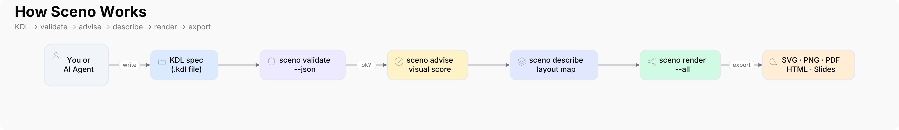

# Sceno

Declarative architecture diagrams in **[KDL](https://kdl.dev/)** — one readable spec, polished SVG/PNG/PDF/HTML/slide exports. Built for humans and **AI agents** that iterate until the spec validates.

**Local-first.** No browser editor, no cloud lock-in, no export surprises — just great diagrams from a single `.kdl` file.

## How it works



1. **Write** a [KDL](https://kdl.dev/) spec (by hand or with an AI agent)
2. **Validate** — `sceno validate --json` catches errors with fix hints
3. **Advise** — stack validation, visual score, design recommendations
4. **Describe** — layout map and edge routes without opening images
5. **Render** — export SVG, PNG, PDF, HTML, and slide decks

The diagram above is defined in [`examples/how-it-works.kdl`](examples/how-it-works.kdl). It dogfoods the icon catalog (`actor`+`user`, `document`+`folder`, `cloud`+`cloud`, … — run `sceno docs icons`) and is checked before every export:

```bash
sceno validate -i examples/how-it-works.kdl --json
sceno advise -i examples/how-it-works.kdl --json   # visual score + arrow/label checks
sceno render -i examples/how-it-works.kdl -o docs/how-it-works.png --format png
```

## For AI agents

**Start every session with:**

```bash
sceno docs guide --json
```

Browse all topics: `sceno docs --json` (guide, spec, goals, practices, stack, validation, errors, shapes, icons). Documentation is **generated from code** at runtime.

**After every KDL edit:**

```bash
sceno validate -i sceno.kdl --json
sceno advise -i sceno.kdl --json   # visual score + stack rules (after ok)
```

The JSON report includes `ok`, `errors` (with `fix` + `example`), `warnings`, `recommendations`, and `agent.next_steps`. Only render when `ok` is true.

See [AGENTS.md](AGENTS.md) for the full agent playbook.

## Why KDL?

- **Readable** — `edge api -> queue`, `shape actor devs "Developers"`, `at=1,2`
- **Declarative** — like Mermaid/d2, but with PowerPoint-familiar shapes, icons, and slides
- **Single format** — the CLI only accepts `.kdl` (no YAML/JSON drift)
- **Self-documenting** — `sceno docs guide`, `sceno docs spec`, `sceno docs goals`, structured validation
- **Agent-friendly** — `validate` + `describe` (2D scene, ASCII map) without viewing images
- **Themed slides** — `theme=dark`, `background=transparent`, syntax-highlighted `code` blocks

Run `sceno docs goals` for the full product goals and ecosystem best practices.

## Install

### One-line install (macOS & Linux)

Installs the **latest published release** — downloads the binary for your OS/arch, verifies SHA256, and installs to `/usr/local/bin`:

```bash
curl -fsSL https://raw.githubusercontent.com/niklas-heer/sceno/main/scripts/install.sh | bash
```

Custom install directory:

```bash
curl -fsSL https://raw.githubusercontent.com/niklas-heer/sceno/main/scripts/install.sh | bash -s -- --dir ~/.local/bin
```

Pin a specific version (optional):

```bash
curl -fsSL https://raw.githubusercontent.com/niklas-heer/sceno/main/scripts/install.sh | bash -s -- --version v0.2.0
```

Or from a [GitHub Release](https://github.com/niklas-heer/sceno/releases) tarball (includes `install.sh`; also installs latest unless you pass `--version`):

```bash
tar -xzf sceno_darwin_arm64.tar.gz
./install.sh --dir ~/.local/bin
```

### Go install

```bash
go install github.com/niklas-heer/sceno/cmd/sceno@latest
```

Ensure `$(go env GOPATH)/bin` is on your `PATH`. The embedded `VERSION` file is used when building without ldflags.

### Build from source

```bash
git clone https://github.com/niklas-heer/sceno.git
cd sceno
mask build    # produces ./sceno (version from VERSION file)
mask install  # go install with build metadata
sceno version
```

Requires **Go 1.25+**.

## Commands

Seven core commands — everything else lives under `sceno docs`:

| Command | Description |
|---------|-------------|
| `sceno init [-o sceno.kdl]` | Create a starter spec |
| `sceno validate -i f --json` | Validate + repair hints + stack rule warnings |
| `sceno advise -i f --json` | Stack engine + visual score + recommendations |
| `sceno advise -i f --ai` | Optional AI review via `SCENO_AI_CMD` |
| `sceno describe -i f --json` | **Visual feedback without images** — narrative, ASCII map, scene, engine, problems |
| `sceno render -i f -o out --all` | Export svg, png, pdf, html, slides.html |
| `sceno render -format slides` | 16:9 HTML presentation |
| `sceno docs [TOPIC] [--json]` | **Self-doc hub** — guide, spec, goals, shapes, icons, stack, errors, … |
| `sceno version [--json]` | Version, commit, build date |

Legacy aliases (`check`, `guide`, `spec`, `goals`, `shapes`, `icons`, `suggest`, `feedback`) still work and print a redirect hint to stderr.

## Quick start

```bash
sceno init -o platform.kdl
# edit platform.kdl
sceno validate -i platform.kdl --json
sceno render -i platform.kdl -o output/sceno --all
```

## Spec example

```kdl
diagram title="My Platform" layout=auto gap=32 padding=24 {

  shape box api "API Gateway" icon=api layer=1
  shape cylinder db "Database" icon=database layer=2
  shape actor ops "Operators" at=0,0

  edge ops -> api fromSide=right toSide=left
  edge api -> db
}
```

> The root block keyword in KDL specs is `diagram { }` — that is the file format, not the CLI name.

## Describe & advise (no vision required)

Agents that cannot view PNG/SVG can sanity-check layout and visual design:

```bash
sceno advise -i examples/how-it-works.kdl --json
sceno describe -i examples/self-service.kdl --json
```

**Advise** fields: `visual_score`, `stack` (plane counts), `engine.findings`, `recommendations`, optional `ai_review`.

**Describe** fields:

- `slides[0].narrative` — plain-language overview + scene summary
- `slides[0].scene` — paint order, groups, occlusion, edge visibility, aesthetic score, `stack`
- `slides[0].engine` — stack validation findings and visual score
- `slides[0].ascii_map` — coarse character grid of node positions and edge paths
- `slides[0].visual_problems` — overlaps, hidden edges, misalignment
- `slides[0].edges[].route` — step-by-step connector path

Stack model details: `sceno docs stack --json`.

## Validation (AI-ready)

`sceno validate --json` returns machine-readable issues:

```json
{
  "ok": false,
  "errors": [
    {
      "code": "missing_node",
      "message": "edge references unknown node \"queue\"",
      "fix": "Add: shape box queue \"Label\" before the edge.",
      "example": "shape box queue \"queue\"\nedge api -> queue"
    }
  ],
  "agent": {
    "summary": "1 error(s) — fix errors before render.",
    "next_steps": ["Fix error 1 ...", "Run: sceno validate -i ..."]
  }
}
```

| Code | Blocks render? |
|------|----------------|
| `parse_error`, `missing_node`, `collision`, `text_overflow`, … | Yes |
| `edge_collision` (through node) | Yes |
| `edge_collision` (crossing) | Warning only |
| `suggest_compact` | Warning only |

## Theme & code (slides)

```kdl
diagram title="Talk" theme=dark background=transparent slide=16x9 layout=auto gap=36 {
  slide "Snippet" {
    code main lang=go source="package main\nfunc main() {}" at=0,0 w=480 h=140
  }
}
```

Override colors: `foreground=#fafafa`, `card=#18181b`, or `var.border=#3f3f46`.

## Slides (declarative decks)

```kdl
diagram title="Talk" slide=16x9 layout=auto gap=36 {
  slide "Problem" {
    shape callout note "Pain point" icon=info at=0,0
  }
  slide "Solution" {
    shape box api "API" icon=api layer=1
    shape box db "DB" icon=database layer=2
    edge api -> db
  }
}
```

```bash
sceno render -i examples/slides-demo.kdl -o output/talk.slides.html -format slides
```

Open `.slides.html` in a browser — **← / → / Space** to navigate. Use `--all` to also get `sceno.slides.html` alongside svg/png/pdf when `-o output/sceno`.

## Shapes & icons

Run `sceno docs shapes` and `sceno docs icons` (categories, suggested pairings, `iconPos` options), or see `examples/shapes-demo.kdl` and the README diagram in `examples/how-it-works.kdl`.

Highlights: `box`, `actor`, `cylinder`, `cloud`, `document`, `callout`, `lane`, `hexagon`, `note`, …

## Export formats

| Format | Use |
|--------|-----|
| SVG | Reference vector (rounded connectors, embedded Inter) |
| PNG | Rasterized from SVG |
| PDF | Vector + Inter |
| HTML | Self-contained page (shadcn/zinc styling) |
| slides | 16:9 HTML deck for presentations |

## Examples

| File | Description |
|------|-------------|
| [examples/how-it-works.kdl](examples/how-it-works.kdl) | README workflow diagram (dogfooded) |
| [examples/self-service.kdl](examples/self-service.kdl) | Platform architecture |
| [examples/slides-demo.kdl](examples/slides-demo.kdl) | Three-slide deck |
| [examples/slides-dark.kdl](examples/slides-dark.kdl) | Dark theme + Go code slide |
| [examples/shapes-demo.kdl](examples/shapes-demo.kdl) | Shape gallery |

## Goals

```bash
sceno docs goals
```

## Development

Requires [mask](https://github.com/jacobdeichert/mask) for project tasks (`brew install mask`).

```bash
mask test      # unit tests (local Go)
mask verify    # quick local build + render smoke test
mask ci        # full CI via Dagger (same as GitHub Actions)
mask build
```

### CI with Dagger

The CI pipeline lives in [`ci/`](ci/) as Go code. Run it locally before pushing:

```bash
# Requires Docker (or Colima) and the Dagger CLI: https://docs.dagger.io/install
mask ci                  # full pipeline: test, smoke, scripts, cross-build
mask ci-test             # tests only
mask ci-smoke            # build + integration smoke checks
dagger functions         # list all pipeline commands
dagger call ci --source=.
```

GitHub Actions is a thin wrapper that calls `dagger call ci` — no duplicated shell in YAML.

## Releasing

One command — semver is inferred from [Conventional Commits](https://www.conventionalcommits.org/) since the last tag, then CI runs, VERSION and CHANGELOG update, and the tag is pushed:

```bash
mask release
```

| Commit prefix | Version bump (on 0.x) |
|---------------|------------------------|
| `fix:` | patch (0.1.0 → 0.1.1) |
| `feat:` | minor (0.1.0 → 0.2.0) |
| `feat!:` or `BREAKING CHANGE:` | major (0.1.0 → 1.0.0) |

`mask release` will:

1. Suggest the next version (e.g. **0.2.0**) and show which commits drove the bump
2. Ask for confirmation (skip with `-y`)
3. Run full CI via Dagger
4. Bump `internal/version/VERSION` and prepend `CHANGELOG.md` — grouped by conventional commit type (`feat`, `fix`, `refactor`, …) with scopes and commit links
5. Commit, tag `vX.Y.Z`, and push — GitHub Actions publishes binaries and uses the CHANGELOG section as the GitHub Release body

Preview without changing anything:

```bash
mask release --dry-run   # includes full release notes preview
mask next-version    # print suggested version only
```

Flags: `-y` confirm, `-n` dry-run, `--skip-ci`, `-V 0.2.1` override version, `-f` release off main.

Pushing `v*.*.*` triggers [`.github/workflows/release.yml`](.github/workflows/release.yml), which builds tarballs, `SHA256SUMS`, and `install.sh` for [GitHub Releases](https://github.com/niklas-heer/sceno/releases).

All tasks are defined in [`maskfile.md`](maskfile.md) (`mask --help`).

## License

MIT — see [LICENSE](LICENSE).
