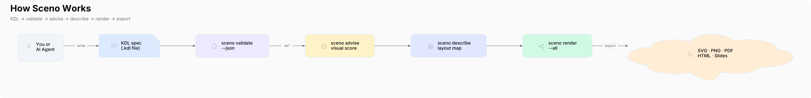

# Sceno

Declarative architecture diagrams in **[KDL](https://kdl.dev/)** — one readable spec, polished SVG/PNG/PDF/HTML/slide exports. Built for humans and **AI agents** that iterate until the spec validates.

**Local-first.** Write KDL in your editor or use the built-in browser preview to inspect geometry, edit source, verify repairs, and export. Everything runs locally from one binary.

## How it works



1. **Write** a [KDL](https://kdl.dev/) spec (by hand or with an AI agent)
2. **Validate** — `sceno validate --json` catches errors with fix hints
3. **Advise** — stack validation, visual score, design recommendations
4. **Describe** — layout map and edge routes without opening images
5. **Render** — export SVG, PNG, PDF, HTML, and slide decks

The diagram above is defined in [`examples/how-it-works.kdl`](examples/how-it-works.kdl). It dogfoods the icon catalog (`actor`+`user`, `document`+`folder`, `cloud`+`cloud`, … — run `sceno docs icons`) and is checked before every export:

```bash
sceno validate -i examples/how-it-works.kdl --json
sceno advise -i examples/how-it-works.kdl --json   # visual score + arrow/label checks
sceno render -i examples/how-it-works.kdl -o docs/how-it-works
```

## Start with a live preview

The live preview, named templates, and verified repairs are available in **v0.5.0 and later**. Install the latest release using the instructions below.

```bash
sceno init --list
sceno init --template service-architecture -o architecture.kdl
sceno preview -i architecture.kdl
```

Choose `service-architecture`, `deployment-pipeline`, `request-flow`, or `presentation`. Existing files are protected; use `init --force` only to replace one deliberately.

The preview opens a local browser session. Edit the KDL in the source panel or your preferred editor; saved changes update the diagram and diagnostics. Click a shape or finding to inspect its computed bounds, spacing, and source line. Structural problems, readability advice, and style suggestions are grouped separately.

For supported geometry repairs, **Review a repair** shows the source diff, measured movement, and validation result before **Apply repair**. **Undo change** restores the previous session edit. A repair must match a current engine suggestion, resolve its targeted issue, and leave other structural evidence unchanged or demonstrably safe. Unrelated findings may remain. Changing labels, deleting shapes, or setting `overlap=allow` requires an intentional source edit. External file changes invalidate pending repairs and session Undo history; unsaved browser drafts are preserved with conflict feedback.

Invalid source keeps the last valid diagram visibly stale, with inspection overlays disabled. Export becomes available when structural findings are resolved. SVG/PNG export the selected slide; PDF and slides export the complete deck. Use `--no-open` to print the local URL without opening a browser, or `--port 8080` to select a port. Stop the session with Ctrl-C.

Polished PNG output is limited to 32 million pixels and 32,768 pixels per side to bound memory use. CLI PNG export uses 2× resolution. For larger canvases, use SVG/PDF or split the diagram into smaller slides.

The preview uses polished rendering, including for sources with sketch routing. `sceno render --style sketch` selects a separate whiteboard renderer for unframed SVG/PNG; full shape, icon, and text parity is not supported there. PDF, HTML, and framed slide exports use polished rendering.

## For AI agents

**Start every session with:**

```bash
sceno docs guide --json
```

Browse all topics: `sceno docs --json` (guide, architecture, spec, goals, practices, visual, stack, validation, errors, shapes, icons). Use `sceno docs architecture --json` for the geometry source-of-truth chain and `sceno docs visual --json` for the measurable composition, shape-content, spacing, and connector contract. Documentation is **generated from code** at runtime.

**After every KDL edit:**

```bash
sceno validate -i sceno.kdl --json
sceno advise -i sceno.kdl --json   # visual score + stack rules (after ok)
sceno describe -i sceno.kdl --json # exact scene, routes, bounds, and ASCII map
```

The JSON report includes `ok`, `errors` (with `fix` + `example`), `warnings`, `recommendations`, and `agent.next_steps`. Only render when `ok` is true. For repository changes, `mask verify` additionally requires every shipped example to score at least 80 with no structural visual findings.

See [AGENTS.md](AGENTS.md) for the full agent playbook.

## Why KDL?

- **Readable** — `edge api -> queue`, `shape actor devs "Developers"`, `at=1,2`
- **Declarative** — like Mermaid/d2, but with PowerPoint-familiar shapes, icons, and slides
- **Single format** — the CLI only accepts `.kdl` (no YAML/JSON drift)
- **Self-documenting** — `sceno docs guide`, `sceno docs spec`, `sceno docs goals`, structured validation
- **Agent-friendly** — `validate` + `describe` (2D scene, ASCII map) without viewing images
- **Themed slides** — `theme=dark`, `background=transparent`, syntax-highlighted `code` blocks

Run `sceno docs goals` for the full product goals and ecosystem best practices.

## Install

### Homebrew (macOS & Linux)

```bash
brew install niklas-heer/tap/sceno
```

The fully qualified formula name lets Homebrew trust only Sceno instead of the complete third-party tap. Upgrade later with `brew upgrade niklas-heer/tap/sceno`.

### Nix flake (Linux & Apple Silicon macOS)

```bash
nix profile add github:niklas-heer/sceno
```

This builds the latest `main` from source. Try it without installing via `nix run github:niklas-heer/sceno -- --version`.

### One-line install (macOS & Linux)

Installs the **latest published release** — downloads the binary for your OS/arch, verifies SHA256, and installs to `/usr/local/bin`:

```bash
curl -fsSL https://raw.githubusercontent.com/niklas-heer/sceno/main/scripts/install.sh | bash
```

Custom install directory:

```bash
curl -fsSL https://raw.githubusercontent.com/niklas-heer/sceno/main/scripts/install.sh | bash -s -- --dir ~/.local/bin
```

Pin a specific version (optional):

```bash
curl -fsSL https://raw.githubusercontent.com/niklas-heer/sceno/main/scripts/install.sh | bash -s -- --version v0.3.0
```

Or from a [GitHub Release](https://github.com/niklas-heer/sceno/releases) tarball (includes `install.sh`; also installs latest unless you pass `--version`):

```bash
tar -xzf sceno_darwin_arm64.tar.gz
./install.sh --dir ~/.local/bin
```

### Go install

```bash
go install github.com/niklas-heer/sceno/cmd/sceno@latest
```

Ensure `$(go env GOPATH)/bin` is on your `PATH`. The embedded `VERSION` file is used when building without ldflags.

### Build from source

```bash
git clone https://github.com/niklas-heer/sceno.git
cd sceno
mask build    # produces ./sceno (version from VERSION file)
mask install  # go install with build metadata
sceno version
```

Requires **Go 1.27.1+**. Go-built macOS binaries require macOS 13 or later.

## Commands

Core commands and the self-documentation hub:

| Command | Description |
|---------|-------------|
| `sceno init [-o sceno.kdl] [--template NAME]` | Create a validated starter; `--list [--json]` lists templates |
| `sceno preview file.kdl` | Live local preview, source editing, geometry inspection, verified repairs, and export |
| `sceno validate -i f --json` | Validate + repair hints + stack rule warnings |
| `sceno advise -i f --json` | Stack engine + visual score + recommendations |
| `sceno advise -i f --ai` | Optional AI review via `SCENO_AI_CMD` |
| `sceno describe -i f --json` | **Visual feedback without images** — narrative, ASCII map, scene, engine, problems |
| `sceno render -i f -o out` | Export PNG (default); `-format svg,pdf` for more; `--all` for every format |
| `sceno render -format slides` | HTML presentation; 16:9 by default, or `slide=4x3` |
| `sceno docs [TOPIC] [--json]` | **Self-doc hub** — guide, spec, goals, shapes, icons, stack, errors, … |
| `sceno version [--json]` | Version, commit, build date |

Legacy aliases (`check`, `guide`, `spec`, `goals`, `shapes`, `icons`, `suggest`, `feedback`) still work and print a redirect hint to stderr.

## Quick start

```bash
sceno init -o platform.kdl
# edit platform.kdl
sceno validate -i platform.kdl --json
sceno render -i platform.kdl -o output/sceno
```

## Spec example

```kdl
diagram title="My Platform" layout=auto gap=32 padding=24 {

  shape box api "API Gateway" icon=api layer=1
  shape cylinder db "Database" icon=database layer=2
  shape actor ops "Operators" at=0,0

  edge ops -> api fromSide=right toSide=left
  edge api -> db
}
```

> The root block keyword in KDL specs is `diagram { }` — that is the file format, not the CLI name.

## Describe & advise (no vision required)

Agents that cannot view PNG/SVG can sanity-check layout and visual design:

```bash
sceno advise -i examples/how-it-works.kdl --json
sceno describe -i examples/self-service.kdl --json
```

**Advise** fields: `visual_score`, `stack` (plane counts), `engine.findings`, `recommendations`, optional `ai_review`.

`slides[]` preserves every slide's full engine, including measured geometry and spacing. Indices are 1-based; merged findings carry `slide_index`, and `engine_slide_index` identifies the lowest-scoring slide used for top-level geometry. AI review receives the per-slide measurements too.

**Describe** fields:

- `slides[0].narrative` — plain-language overview + scene summary
- `slides[0].scene` — paint order, groups, occlusion, edge visibility, aesthetic score, `stack`
- `slides[0].engine` — stack validation findings and visual score
- `slides[0].ascii_map` — coarse character grid of node positions and edge paths
- `slides[0].visual_problems` — overlaps, hidden/detached arrows, label collisions, text overflow, exact geometry, and repair candidates
- `slides[0].edges[].route` — step-by-step connector path

`slides[n].engine.scene_stack.planes.*[]` includes every semantic plane, source order, parent containment, outer `bounds`, visible `outline`, `internal_lines`, silhouette-safe `writable_bounds`, selected `effective_font_size`, and exact nested icon/title/subtitle `content` boxes. These are the same computed numbers consumed by SVG, PNG, PDF, HTML, and slides.

`slides[n].engine.spacing` makes spacing explicit in pixels: nearest-neighbor and below-clearance node pairs, signed horizontal/vertical gaps, content padding inside writable and outer bounds, parent insets, and canvas margins. Negative padding means overflow. Peer clearances use axis-aligned bounds, not silhouette distances; intentional overlap remains measurable. Large pair reports expose a limit and `truncated` flag so agents can tell when the list is incomplete.

Collision problems include exact `bounds`, the `overlap` rectangle, and candidate `repairs` such as `{ "dx": "48" }`. Apply one candidate to the KDL and run the loop again; candidates are local suggestions, not a substitute for revalidation.

### Layout control

- `layout=auto` keeps ordinary shapes collision-safe with `layer`, `row`, and `at=col,row`.
- `dx` / `dy` nudges one element after auto-layout while preserving its logical slot.
- `layout=hybrid` mixes the auto-grid with independently placed `x` / `y` callouts, text, or decorative elements.
- `layout=free` requires `x` and `y` on every shape for slide-like composition.
- `overlap=allow` marks deliberate overlap; the semantic plane and source order remain explicit in `slides[n].engine.scene_stack`.

Grid indices (`row`, `layer`, `at`) must be integers from 0 through 10,000. Numeric geometry—including positions, nudges, dimensions, font sizes, gap, and padding—must be finite and have absolute magnitude at most 1,000,000.

Sceno intentionally keeps KDL declarative rather than embedding a scripting runtime. Deterministic constraints make the resulting scene explainable to agents and identical across exports.

Stack model details: `sceno docs stack --json`.

## Validation (AI-ready)

`sceno validate --json` returns machine-readable issues:

```json
{
  "ok": false,
  "errors": [
    {
      "code": "missing_node",
      "message": "edge references unknown node \"queue\"",
      "fix": "Add: shape box queue \"Label\" before the edge.",
      "example": "shape box queue \"queue\"\nedge api -> queue"
    }
  ],
  "agent": {
    "summary": "1 error(s) — fix errors before render.",
    "next_steps": ["Fix error 1 ...", "Run: sceno validate -i ..."]
  }
}
```

| Code | Blocks render? |
|------|----------------|
| `parse_error`, `missing_node`, `collision`, `text_overflow`, … | Yes |
| `edge_collision` (through node) | Yes |
| `edge_collision` (crossing) | Warning only |
| `suggest_compact` | Warning only |

## Theme & code (slides)

```kdl
diagram title="Talk" theme=dark background=transparent slide=16x9 layout=auto gap=36 {
  slide "Snippet" {
    code main lang=go source="package main\nfunc main() {}" at=0,0 w=480 h=140
  }
}
```

Override colors: `foreground=#fafafa`, `card=#18181b`, or `var.border=#3f3f46`.

## Slides (declarative decks)

```kdl
diagram title="Talk" slide=16x9 layout=auto gap=36 {
  slide "Problem" {
    shape callout note "Pain point" icon=info at=0,0
  }
  slide "Solution" {
    shape box api "API" icon=api layer=1
    shape box db "DB" icon=database layer=2
    edge api -> db
  }
}
```

```bash
sceno render -i examples/slides-demo.kdl -o output/talk.slides.html -format slides
```

Open `.slides.html` in a browser — **← / → / Space** to navigate. Use `--all` to also get `sceno.slides.html` alongside svg/png/pdf when `-o output/sceno`.

## Shapes & icons

Run `sceno docs shapes` and `sceno docs icons` (categories, suggested pairings, `iconPos` options), or see `examples/shapes-demo.kdl` and the README diagram in `examples/how-it-works.kdl`.

Highlights: `box`, `actor`, `cylinder`, `cloud`, `document`, `callout`, `lane`, `hexagon`, `note`, …

Shape text is fitted automatically: Sceno derives writable space from the visible silhouette, border stroke, and internal seams, then chooses the largest readable font that fits (10px minimum). If content still cannot fit, `text_overflow` reports the shape, writable, and content bounds with a size repair candidate.

## Export formats

| Format | Use |
|--------|-----|
| SVG | Reference vector (rounded connectors, embedded Inter) |
| PNG | Polished output rasterized from SVG with embedded Inter glyphs |
| PDF | Vector + Inter |
| HTML | Self-contained page (shadcn/zinc styling) |
| slides | 16:9 or 4:3 HTML deck for presentations |

## Examples

| File | Description |
|------|-------------|
| [examples/how-it-works.kdl](examples/how-it-works.kdl) | README workflow diagram (dogfooded) |
| [examples/self-service.kdl](examples/self-service.kdl) | Platform architecture |
| [examples/slides-demo.kdl](examples/slides-demo.kdl) | Three-slide deck |
| [examples/slides-dark.kdl](examples/slides-dark.kdl) | Dark theme + Go code slide |
| [examples/shapes-demo.kdl](examples/shapes-demo.kdl) | Shape gallery |

## Goals

Sceno's core goal is to bridge text and visual work: an agent authors one deterministic KDL source, receives an exact textual account of the computed canvas, applies actionable feedback, and exports the same scene in every format. Auto layout should prevent accidental collisions; hybrid/free placement and intentional overlap retain slide-like creative freedom without hiding geometry from the agent.

The runtime goals document is the source of truth for product goals, non-goals, quality targets, and the agent loop:

```bash
sceno docs goals --json
```

## Development

Requires [mask](https://github.com/jacobdeichert/mask) for project tasks (`brew install mask`).

```bash
mask test      # unit tests (local Go)
mask test-ui   # preview state tests (Node.js; included in Dagger CI)
mask verify    # all KDL examples: validate, advise, describe, and every export
mask ci        # full CI via Dagger (same as GitHub Actions)
mask build
```

### CI with Dagger

The CI pipeline lives in [`ci/`](ci/) as Go code. Run it locally before pushing:

```bash
# Requires Docker (or Colima) and the Dagger CLI: https://docs.dagger.io/install
mask ci                  # full pipeline: test, smoke, scripts, cross-build
mask ci-test             # tests only
mask ci-smoke            # build + integration smoke checks
dagger functions         # list all pipeline commands
dagger call ci --source=.
```

GitHub Actions is a thin wrapper that calls `dagger call ci` — no duplicated shell in YAML.

### Repository hygiene

- Commit source, tests, KDL fixtures, runtime documentation, and `docs/how-it-works.png`. The PNG is a deliberate tracked README asset generated from `examples/how-it-works.kdl` with `mask docs-diagram`.
- Ignore local build and review output: `/sceno`, `/dist/`, `/output/`, coverage/profiling files, `.env*`, `.DS_Store`, and Dagger-generated `ci/dagger.gen.go` / `ci/internal/` bindings.
- Before committing, run `git status --short --ignored` to confirm every remaining file is intentionally tracked or ignored; do not commit generated release bundles or visual-audit output.

## Releasing

One command — semver is inferred from [Conventional Commits](https://www.conventionalcommits.org/) since the last tag, then CI runs, VERSION and CHANGELOG update, and the tag is pushed:

```bash
mask release
```

| Commit prefix | Version bump (on 0.x) |
|---------------|------------------------|
| `fix:` | patch (0.1.0 → 0.1.1) |
| `feat:` | minor (0.1.0 → 0.2.0) |
| `feat!:` or `BREAKING CHANGE:` | major (0.1.0 → 1.0.0) |

`mask release` will:

1. Suggest the next version (e.g. **0.4.0**) and show which commits drove the bump
2. Ask for confirmation (skip with `-y`)
3. Run full CI via Dagger
4. Bump `internal/version/VERSION` and prepend `CHANGELOG.md` — grouped by conventional commit type (`feat`, `fix`, `refactor`, …) with scopes and commit links
5. Commit, tag `vX.Y.Z`, and push — GitHub Actions publishes binaries and uses the CHANGELOG section as the GitHub Release body

After GitHub publishes the release archives, update `Formula/sceno.rb` in [`niklas-heer/homebrew-tap`](https://github.com/niklas-heer/homebrew-tap) with the new version and the four hashes from `SHA256SUMS`. Verify with `brew audit --strict --online niklas-heer/tap/sceno`, `brew install niklas-heer/tap/sceno`, and `brew test niklas-heer/tap/sceno`.

Preview without changing anything:

```bash
mask release --dry-run   # includes full release notes preview
mask next-version    # print suggested version only
```

Flags: `-y` confirm, `-n` dry-run, `--skip-ci`, `-V 0.3.1` override version, `-f` release off main.

Pushing `v*.*.*` triggers [`.github/workflows/release.yml`](.github/workflows/release.yml), which builds tarballs, `SHA256SUMS`, and `install.sh` for [GitHub Releases](https://github.com/niklas-heer/sceno/releases).

All tasks are defined in [`maskfile.md`](maskfile.md) (`mask --help`).

## License

MIT — see [LICENSE](LICENSE).
